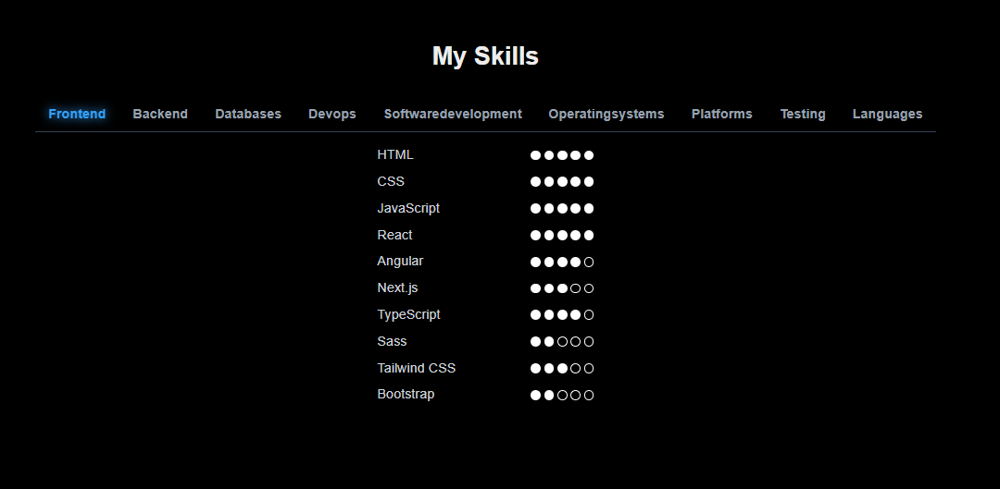
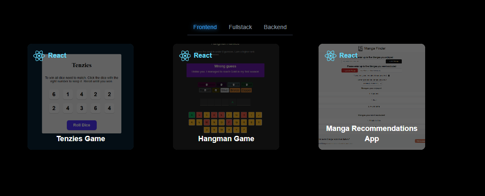

# Sebastian Riedel Portfolio

Welcome to my portfolio! Here you'll find some of the web projects I've built.

---

### Portfolio Page
**Description:**  
This site represents my own porfolio page. The site gives information about me as a person, my technical skills, as well as a overview of my past projects.

**GitHub Repo:** [Link to repo](https://github.com/SebastianR0589/sebastian_riedel_portfolio_page)

**Screenshots:**

**Features:**
- Personal information text block
- Quick overview of my technical skills, represented in a dot-system
- Overview and links to my past projects

**Tech Stack:**  
Next.js, React, Rect-Icons, Tailwind